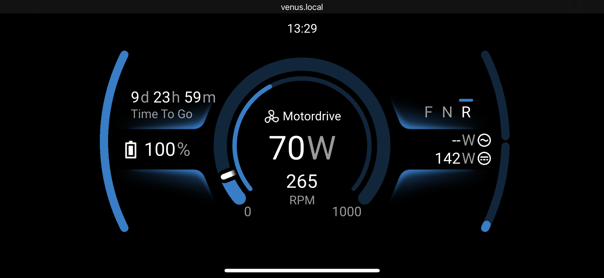

# dbus-canopen-motordrive

Venus OS driver for Sevcon Gen4 & Curtis F series controllers: enables communication and motordrive data reporting via D-Bus.

## Features

- Works out of the box without the need to re-configure the motor controller.
- Compatible with Sevcon Gen4 AC & Curtis F series controllers.
- Report motor power, rpm, direction, temperature, torque and controller temperature.
- Easy setup. Scan the CAN bus and find compatible motor controllers.
- Supports multiple controllers on the same bus (each controller must have a unique CANopen node ID).

## How to connect the Sevcon controller to a Victron GX product

Victron GX products: https://www.victronenergy.com/live/venus-os:start.  

Connect the CAN output from the Sevcon controller to the Victron product's VE.Can port #1.

A modified RJ45 cable can be sufficient.

| Role| RJ45 pin # | Controller pin |
|-----|------------|----------------|
| CAN Ground | 3 (Green/White) | B- |
| CAN High | 7 (Brown/White) | 13 or 16 |
| CAN Low | 8 (Brown) | 24 or 27 |

### CAN Ground

Ensure that there is a common ground connection for all nodes on the CAN bus.  
If there is a node on the bus which is galvanically isolated from the Gen4 controller then the CAN ground on this node must be connected to the Gen4 controller B-.

### CAN Termination

If your system has more than one CAN node, connect the nodes in a 'daisy chain' arrangement
and terminate the connections of the two end nodes with a 120 ohms resistor.  
If the end node is a Gen4, link pins 2 and 24 on the customer connector, a 120 ohms resistor is built into the controller.  
If you have a single node system the termination resistor should be connected so that the bus operates correctly when configuration tools are used.

On the VE.Can side, it can be terminated with a dedicated [VE.Can Terminator](https://www.victronenergy.com/accessories/ve-can-rj45-terminator).

Sevcon gen4 manual: https://www.thunderstruck-ev.com/images/Gen4%20Product%20Manual%20V3%204.pdf

### Sevcon Gen4 Model support

Driver has been tested on Sevcon Gen4 AC size 4 controller.  
It should work identically with size 2 and size 6 controllers.  
Not tested on Gen4 DC controllers.

## How to connect the Curtis controller to a Victron GX product

For models with 35 pin Ampseal connectors (e.g. F6-A/F4-A), connect the GX device using the following pins:
* Either CAN1 with CAN1 Low on pin 35 and CAN1 High on pin 23, or
* CAN2 using CAN2 Low on pin 29 and CAN2 High on pin 28

Note that some 35 pin models have termination resistor pins, please consult the manual to identify those.  
If the model has isolated CAN ports, the Isolated GND (pin34) should be connected to the ground used by the GX device otherwise both devices should share the same grounds

For models with 23 pin Ampseal connectors (e.g. F2-A), connect the GX device using the following pins:
* CAN Low on pin 20 and CAN High on pin 23
* The F2-A does not have isolated CAN interfaces, the GX device should be on the same ground as the controller.
* Some variants of the F2-A have internal termination resistors and some don't - please consult the manual

The following Curtis webpage should indicate the capabilities of each model https://www.curtisinstruments.com/products/motor-controllers

### Curtis F series support

Driver has been tested on the Curtis F6-A software version 4.6.0.6 however should work on any F series controllers.

## How to configure the Victron GX product

Requires Venus OS version 3.70~45 or later.

1. Go to Settings > Connectivity > `<CAN port>` > CAN-bus profile

2. Select either `CANopen Motor drive (250 kbit/s)` or `CANopen Motor drive (500 kbit/s)`.
3. Go to Settings > Connectivity > `<CAN port>` > CANopen motor drives  
4. Ensure the motor controller is properly connected to the Victron GX product's CAN port. (See instructions above).  
Ensure the motor controller is powered ON.  
Press scan.

The CANopen node ID of the discovered controllers will be displayed in the field `Discovered motor drive IDs`.  
Discovered controllers will persist through reboots and updates.  

## Sevcon - Which SDOs are used by the driver

| index | subindex | Description |
|------------|----------------|---|
| 0x1008 | 0 | Controller Name |
| 0x1018 | 4 | Controller Serial Number |
| 0x5100 | 1 | Battery Voltage, 1 = 0.0625V |
| 0x5100 | 2 | Battery Current, 1 = 0.0625V |
| 0x606c | 0 | Motor RPM |
| 0x4600 | 3 | Motor Temperature |
| 0x4602 | 0xC | Motor Torque |
| 0x5100 | 4 | Controller Temperature |

## Curtis - Which SDOs are used by the driver

| index | subindex | Description |
|------------|----------------|---|
| 0x1008 | 0 | Controller Name |
| 0x1018 | 4 | Controller Serial Number |
| 0x34C1 | 0 | Capacitor Volts, 1 = 0.01V |
| 0x338F | 0 | Battery Current, 1 = 0.1A |
| 0x352F | 0 | Motor RPM |
| 0x3536 | 0 | Motor Temperature |
| 0x3538 | 0 | Motor Torque |
| 0x3000 | 0 | Controller Temperature |
| 0x362F | 0 | Swap Motor Direction |

Note that the device power is calculated as Capacitor Volts * Battery Current which is equivalent of the Curtis SDO 0x3390 (Battery Power)
